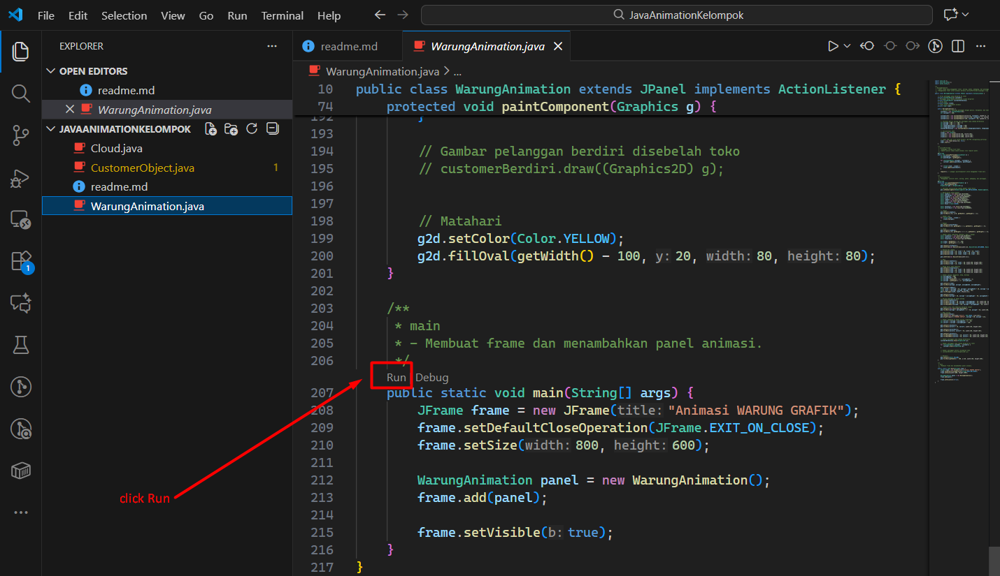

# Warung Animation (Java)

## Steps
1. Download langsung via tombol `<> Code` -> `Download ZIP` diatas
2. Extract folder nya bebas ke mana aja
3. The program entry point is the `main` method in [`WarungAnimation.main`](WarungAnimation.java).

### Run in VS Code
- Open folder `JavaAnimationKelompok` -> Right-click -> Show more options -> Open with Code
- Open `WarungAnimation.java`.
- Use the "Run" code lens above `main` (baris 207), or right-click the file and choose "Run Java"
- 

### Run from BlueJ (ribet not recommend)
- Buka BlueJ, `Project` -> `New Project...`
- Name isi 'WarungGrafikAnimation' -> OK
- Create `New Class...`
- Class Name isi 'WarungAnimation.java' -> OK
- Copas isi code dari sini [WarungAnimation.java](WarungAnimation.java)
- Compile
- Lakuin hal yang sama buat [Cloud.java](Cloud.java) dan [CustomerObject.java](CustomerObject.java)
- Siap di Run
- Done

## Files
- [WarungAnimation.java](WarungAnimation.java) — contains the `main` method.
- [Cloud.java](Cloud.java)
- [CustomerObject.java](CustomerObject.java)

## Notes
- If the files declare a package, run/compile from the project root and use the fully qualified class name when running `java`.
- If you see compilation errors, ensure all three `.java` files are in the same folder and you used the correct JDK.
